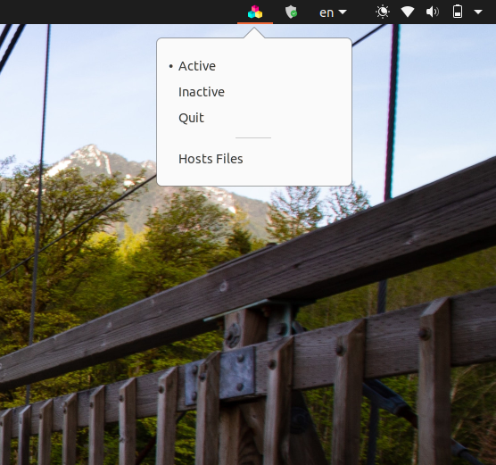

#Ad-blocker

##Description
Hosts file based ad-blocker for linux.

##Feature
*Quick access to ad-block using gtk appIndicator.
##Preview

Format: 

##Setup
*Own the /etc/hosts file using command chown if you're not root user or using chmod 666.
*Add your blacklisted hosts file into Ad-block/hosts/hosts_up (By default Adaway hosts file included)
*Run command 'python3 main.py'
*To run ad-blocker as background use nohup, or run './script.sh'
